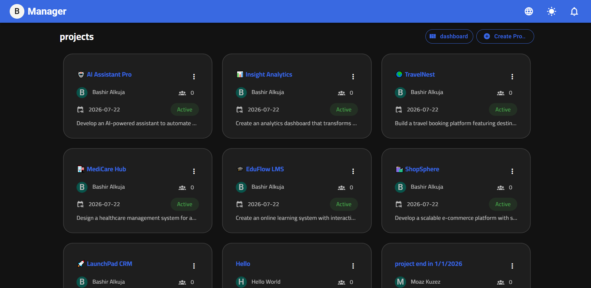

# Project Management App

A simple **Project Management (Task Tracker) web application** built with **Vue.js + Vite**.  
This app lets you create, organize, and track tasks/projects with a modern frontend UI.

🔗 Live Demo: https://project-mng-jade.vercel.app

---

## 🚀 Features

✔ Create new projects  
✔ Add and update tasks  
✔ Mark tasks as done  
✔ Delete tasks  
✔ Responsive and clean UI
✔ Drag-and-drop tasks to reorder
✔ invtation to join projects via email


---

## 📦 Tech Stack

🛠 Built with:  
- **Vue.js** & **vuetify** (Frontend)  
- **Vite** (Fast development tooling)  
- **JavaScript**
- **CSS** for styling
- **Vercel** for deployment
- **vue-draggable-plus** for drag-and-drop functionality
- **vue-i18n** for internationalization
- **chart.js** for data visualization
- vue-router

---

## 📁 Installation

1. **Clone repository**  
   ```bash
   git clone https://github.com/moh-bash/project_mng.git
   
   ```

2.Install dependencies
`npm install
`

3.Run locally
`npm run dev
`

---

## 📊 Usage
 Once running locally:
- Visit http://localhost:3000 in your browser
- Create a task or project
- Mark tasks as completed


---

## 🎯 Screenshots
Include screenshots of:
- Landing page
  
   <div align="center" style="pading: 5px">
   
   </div>
- Task creation UI
  
   <div align="center">
   
   </div>
- Completed tasks
  
   <div align="center">
   
   </div>

---

## 🤝 Contributes
If you'd like to contribute to this project, please follow these steps:
1. Fork the repository
2. Create a new branch
3. Make your changes
4. Submit a pull request

---

## 🧠 What I Learned
- Handling state in Vue
- Component architecture
- Frontend interactions
- DOM manipulation

---

## 📌 Notes
This is a portfolio / practice project to master front-end skills and GitHub usage.

---


## 📄 License
MIT
